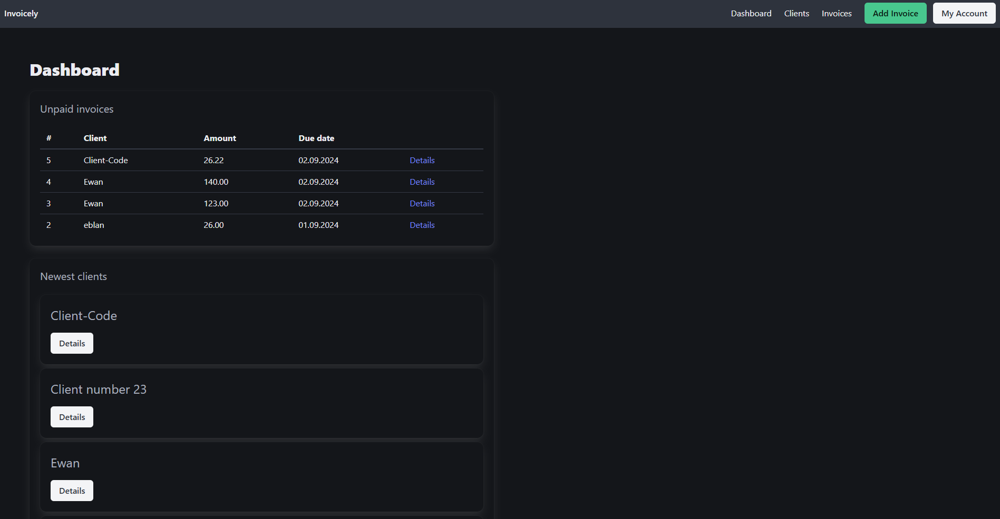
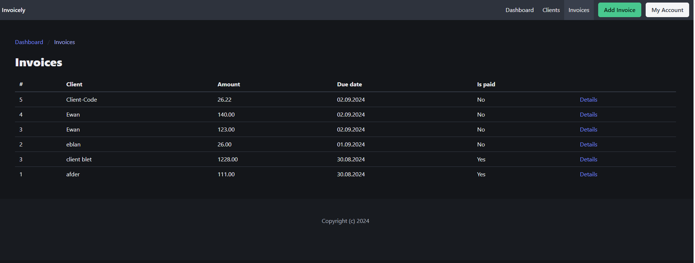
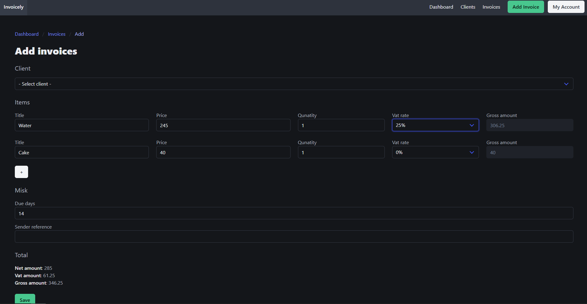
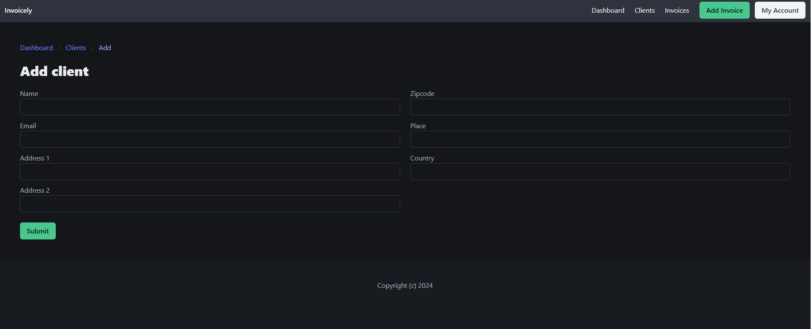
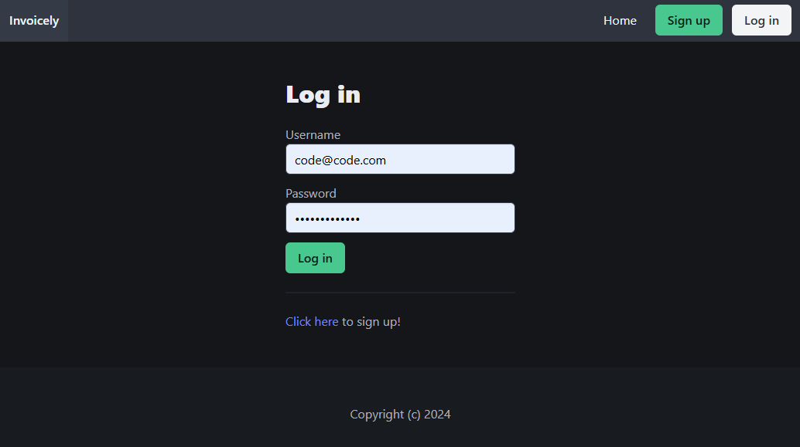

# 🧾 Invoicely

Invoicely is a simple but functional invoicing web application built with **Django REST Framework** on the backend and **Vue 3** on the frontend. It allows users to register, log in, manage clients and generate invoices, with token-based authentication and a clean, modern UI.

---

## ⚙️ Tech Stack

**Backend:**
- Python + Django 5
- Django REST Framework
- Djoser (Token Authentication)
- SQLite (can be easily replaced)

**Frontend:**
- Vue 3
- Vuex
- Vue Router
- Axios
- Bulma CSS framework

---

## 🚀 Key Features

- 🔐 User registration & login (Token Auth)
- 🧾 Invoice creation & listing
- 👥 Client management
- 🧭 Protected dashboard routes
- 💡 Vuex-powered authentication state
- 🌐 CORS-enabled API communication

---

## 📦 Project Structure

The project is fully modular:
- `invoicely/` – Django backend project with `client`, `invoice`, and `team` apps
- `invoicely_vue/` – Vue frontend with router, store, and components

---

## 🚀 How to run

### Backend

```bash
cd invoicely
python -m venv venv
source venv/bin/activate # or venv\Scripts\activate on Windows
pip install -r requirements.txt
python manage.py migrate
python manage.py runserver
```
### Frontend

```bash
cd invoicely_vue
npm install
npm run serve
```

---

## 📸 Screenshots

### 🔹 Dashboard  
Show current unpaid invoices and recently added clients.


### 🔹 Invoices  
View all issued invoices with the amount, date and payment status.


### 🔹 Add Invoice  
Create a new invoice by selecting a client, goods and taxes.


### 🔹 Add Client  
Form for adding a new client to the system.  


### 🔹 Login  
Login form for user authorization.  

